# 8-Bit ALU — RTL-to-GDSII ASIC Implementation

An end-to-end **RTL-to-GDSII ASIC physical design project** implementing an 8-bit RISC-V-inspired ALU using open-source EDA tools and the Nangate45 standard-cell library.

The project covers RTL design, simulation, synthesis, floorplanning, placement, clock-tree synthesis (CTS), routing, parasitic extraction, post-route static timing analysis (STA), GDSII generation, KLayout visualization, and initial DRC analysis.

> **Status:** RTL-to-GDSII flow completed successfully. Routing and antenna checks are clean. Initial KLayout DRC reports 78 `WELL.4` markers; LVS and final power analysis are still pending.

---

## Project Overview

The design is an **8-bit registered ALU** supporting eight operations:

| ALU Operation | Function |
|---|---|
| `000` | ADD |
| `001` | SUB |
| `010` | AND |
| `011` | OR |
| `100` | XOR |
| `101` | SLL |
| `110` | SRL |
| `111` | SLT |

The ALU also generates:

- Zero flag
- Carry flag
- Overflow flag
- Negative flag

### Architecture

```text
                 +----------------------+
 rs1 ---------->|                      |
 rs2 ---------->|   Input Registers    |
 alu_op -------->|                      |
 rst ----------->|                      |
                 +----------+-----------+
                            |
                            v
                 +----------------------+
                 |    Combinational      |
                 |      8-bit ALU        |
                 +----------+-----------+
                            |
                            v
                 +----------------------+
                 |    Output Registers  |
                 +----------+-----------+
                            |
                            v
              result / zero / carry /
              overflow / negative
```

The implementation therefore follows:

**Input FF → Combinational ALU → Output FF**

This also makes the design suitable for demonstrating a complete synchronous ASIC implementation flow.

---

# 1. Tools and Technology

## Open-Source EDA Tools

| Tool | Purpose |
|---|---|
| Icarus Verilog | RTL simulation |
| GTKWave | Waveform analysis |
| Yosys | Logic synthesis |
| OpenROAD | Floorplanning, placement, CTS, routing, extraction |
| OpenSTA | Static timing analysis |
| KLayout | GDSII visualization and DRC |
| Netgen LVS | LVS infrastructure |
| Git / GitHub | Version control and project presentation |

## Technology

**Nangate45 / FreePDK45**

Technology files used include:

- Nangate45 technology LEF
- Nangate45 standard-cell LEF
- Nangate45 typical Liberty library
- Routing tracks
- RC extraction rules
- NangateOpenCellLibrary GDS
- FreePDK45 KLayout technology configuration

---

# 2. Repository Structure

```text
RV8_ALU/
├── constraints/
│   └── rv8_alu.sdc
│
├── openroad/
│
├── reports/
│
├── results/
│   ├── rv8_alu.spef
│   ├── rv8_alu_final.def
│   ├── rv8_alu_final.gds
│   ├── rv8_alu_gds.def
│   ├── rv8_alu_postroute.def
│   ├── rv8_alu_postroute.v
│   └── screenshots/
│
├── rtl/
│   └── rv8_alu.v
│
├── synthesis/
│   └── rv8_alu_synth.v
│
├── sta/
│
├── tb/
│   └── rv8_alu_tb.v
│
├── .gitignore
└── README.md
```

---

# 3. RTL Design

The ALU was written in synthesizable SystemVerilog.

### Supported Operations

```text
ADD  → rs1 + rs2
SUB  → rs1 - rs2
AND  → rs1 & rs2
OR   → rs1 | rs2
XOR  → rs1 ^ rs2
SLL  → rs1 << rs2
SRL  → rs1 >> rs2
SLT  → signed(rs1) < signed(rs2)
```

The design uses a synchronous reset and registered inputs/outputs.

This provides a simple but realistic datapath for demonstrating synthesis and physical design.

---

# 4. RTL Verification

The RTL testbench exercises all eight ALU operations.

Simulation was performed using **Icarus Verilog**, and the generated VCD waveform was inspected using **GTKWave**.

All eight functional operation tests passed.

The waveform also confirms the expected **one-cycle registered latency** between applying an operation and observing the registered result.

### Verification Flow

```text
RTL
 |
 v
Icarus Verilog
 |
 v
Testbench
 |
 v
VCD waveform
 |
 v
GTKWave
```

The generated simulation artifacts are intentionally ignored from Git because they are reproducible:

```text
a.out
simulation.vvp
rv8_alu.vcd
```

---

# 5. RTL Simulation Waveform

The waveform was inspected in GTKWave to verify:

- Clock behavior
- Reset behavior
- ALU inputs
- Operation selection
- Registered result
- Status flags
- One-cycle latency

---

# 6. Logic Synthesis

The RTL was synthesized using **Yosys** against the Nangate45 typical Liberty library.

The synthesis flow included:

1. RTL parsing
2. Hierarchy analysis
3. Process conversion
4. Logic optimization
5. Technology mapping
6. Flip-flop mapping
7. ABC optimization
8. Final gate-level netlist generation

### Final Synthesis Statistics

| Metric | Result |
|---|---:|
| Total cells | 271 |
| DFF_X1 | 31 |
| AND2_X1 | 34 |
| NAND2_X1 | 29 |
| NOR2_X1 | 25 |
| XOR2_X1 | 10 |
| XNOR2_X1 | 9 |
| INV_X1 | 12 |
| MUX2_X1 | 8 |

The synchronous reset is implemented as logic feeding the D inputs of the registers rather than using dedicated reset flip-flops.

Generated netlist:

```text
synthesis/rv8_alu_synth.v
```

---

# 7. Timing Constraints

The design is constrained using an SDC file.

### Clock

```tcl
create_clock -name clk -period 10 [get_ports clk]
```

This corresponds to:

- Clock period: **10 ns**
- Clock frequency: **100 MHz**

Input and output delays are constrained to 1 ns relative to the clock.

---

# 8. Pre-Layout Static Timing Analysis

OpenSTA was used for pre-layout timing analysis.

### Pre-Layout Timing

| Metric | Result |
|---|---:|
| Clock period | 10 ns |
| Frequency | 100 MHz |
| Worst setup slack | +9.35 ns |
| Worst hold slack | +0.12 ns |
| TNS | 0 ns |

The critical register-to-register path had approximately **9.35 ns positive setup slack**, indicating substantial timing margin before physical effects.

---

# 9. Floorplanning

The synthesized design was imported into OpenROAD and a floorplan was initialized using the Nangate45 site definition.

### Floorplan Configuration

- Target utilization: 50%
- Aspect ratio: 1.0
- Core spacing: 2 µm
- Die size: approximately **32.5 × 32.5 µm**
- Core area: approximately **753 µm²**

The resulting reported design area after implementation is approximately **415 µm²**, with approximately **55% reported utilization**.

### Floorplan View

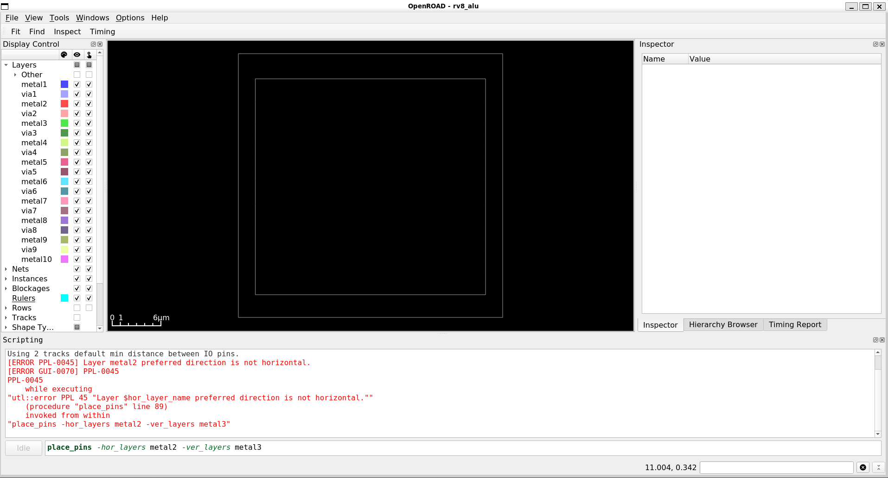

---

# 10. I/O Pin Placement

I/O pins were placed on the available routing layers using OpenROAD pin-placement commands.

The current successful implementation places the I/O pins on the right side of the design.

> Note: an alternative pin-side arrangement was considered, but the current final GDS was intentionally preserved without rerunning the complete physical-design flow.

### I/O Pin View


---

# 11. Global Placement

Global placement was performed using OpenROAD followed by detailed placement.

### Placement Goals

- Distribute standard cells across the core
- Maintain legal cell placement
- Reduce wirelength
- Prepare the design for CTS and routing

### Global Placement View

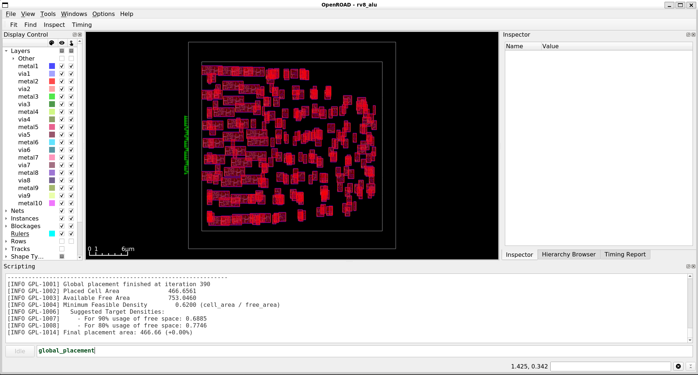

---

# 12. Detailed Placement

Detailed placement was performed after global placement to ensure that standard cells were aligned to legal placement sites.

OpenROAD placement checks completed successfully.

### Detailed Placement View

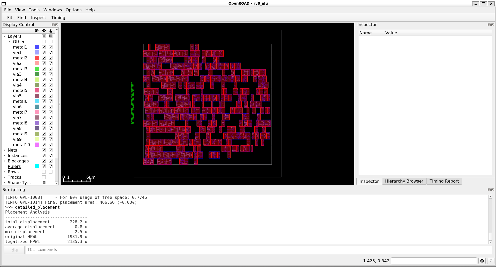

---

# 13. Clock Tree Synthesis

Clock Tree Synthesis was performed using OpenROAD with Nangate45 clock buffers:

```text
CLKBUF_X1
CLKBUF_X2
CLKBUF_X3
```

### CTS Summary

| Metric | Result |
|---|---:|
| Clock sinks | 31 |
| Clock buffers | 5 |
| Clock nets | 5 |
| Buffer levels | 2 |
| Root buffer | CLKBUF_X3 |
| Sink buffer | CLKBUF_X1 |
| Reported setup skew | ~0 ns |

CTS was followed by detailed placement and placement legality checks.

### CTS View

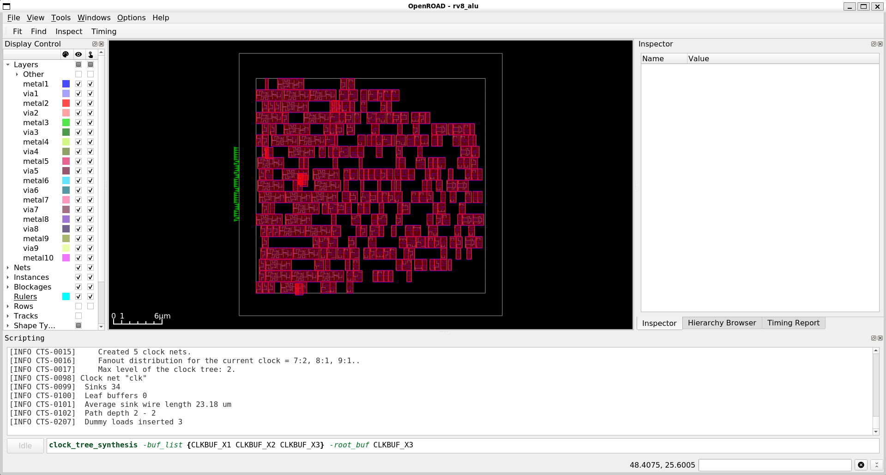

---

# 14. Post-CTS / Parasitic Extraction View

The physical implementation was inspected after CTS and during the parasitic-extraction stage.


---

# 15. Global Routing and Detailed Routing

Global routing followed by detailed routing was performed using OpenROAD.

The detailed router completed with:

```text
DRT-0199 violations = 0
```

### Routing Statistics

| Layer | Wire Length |
|---|---:|
| Metal 2 | ~1199 µm |
| Metal 3 | ~1259 µm |
| Metal 4 | ~25 µm |
| Total | ~2483 µm |

Approximately **1959 vias** were reported.

No final detailed-routing violations were reported.

### Routing / Physical Design View

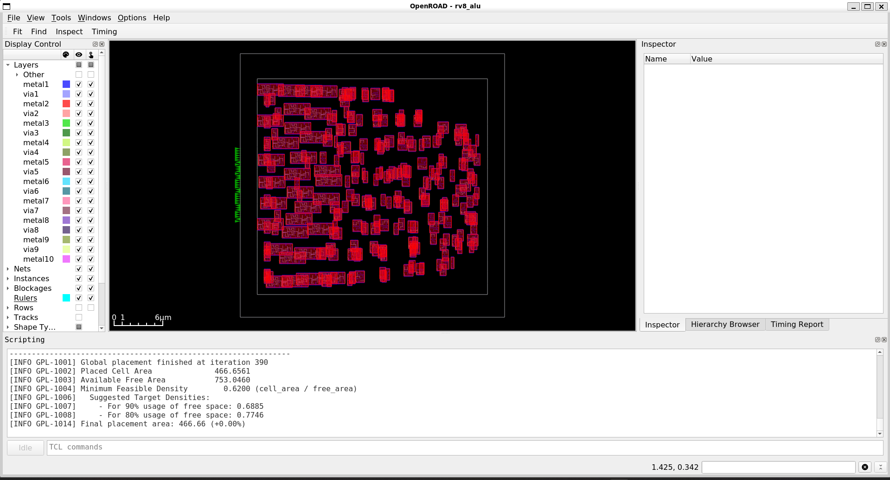

---

# 16. Parasitic Extraction

Post-route parasitic extraction was performed using the Nangate45 RC extraction rules.

OpenROAD extracted:

- RC segments
- Wire resistance
- Ground capacitance
- Coupling capacitance

The extracted parasitics were written to:

```text
results/rv8_alu.spef
```

### Extraction Summary

| Metric | Result |
|---|---:|
| RC segments | 1148 |
| Extracted wires | 1938 |
| Nets | 326 |
| R-segments | 1453 |
| Capacitance entries | 1453 |
| Coupling capacitance entries | 2936 |

---

# 17. Post-Route Static Timing Analysis

Post-route STA was performed using:

- Nangate45 Liberty
- Post-route Verilog
- Original SDC
- Extracted SPEF

### Post-Route Timing

| Metric | Result |
|---|---:|
| Clock period | 10 ns |
| Frequency | 100 MHz |
| Worst setup slack | **+8.86 ns** |
| Worst hold slack | **+0.13 ns** |
| TNS | **0 ns** |

The main register-to-register timing path remains around **+9.35 ns setup slack**, while the overall worst setup path is an input-to-register path involving reset.

The design therefore remains timing-clean after routing.

---

# 18. Physical Design Checks

Several implementation checks were performed after routing.

### Placement

```text
check_placement
```

Result:

```text
Clean
```

### Antenna

```text
check_antennas
```

Result:

```text
0 net violations
0 pin violations
```

### Detailed Routing

```text
DRT-0199 violations = 0
```

These results indicate that the routed design is physically consistent with the checks available in the current OpenROAD build.

---

# 19. Final Routed Layout

The final routed DEF was written to:

```text
results/rv8_alu_postroute.def
```

The post-route netlist was written to:

```text
results/rv8_alu_postroute.v
```

The routed layout was reopened in OpenROAD for visual inspection.

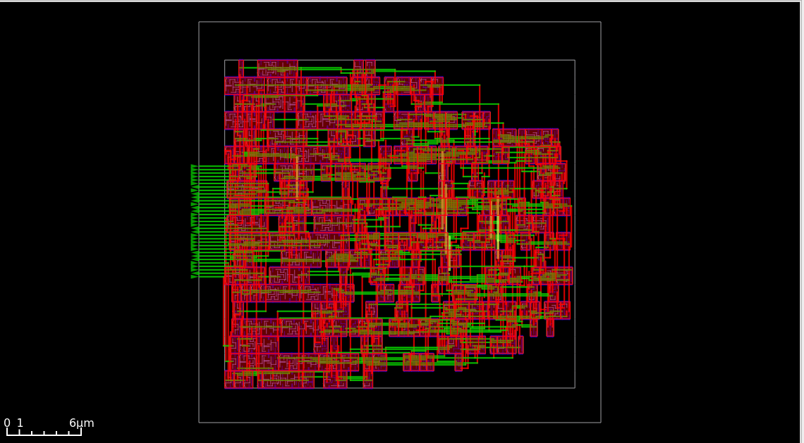

---

# 20. GDSII Generation

The final layout was streamed out to GDSII using **KLayout** and the NangateOpenCellLibrary GDS data.

The stream-out completed with:

```text
All LEF cells have matching GDS/OAS cells
No orphan cells in the final layout
```

Final GDS:

```text
results/rv8_alu_final.gds
```

Approximate file size:

```text
198 KB
```

The final GDS was opened successfully in KLayout and contains the `rv8_alu` top-level cell.

### Final GDS Views

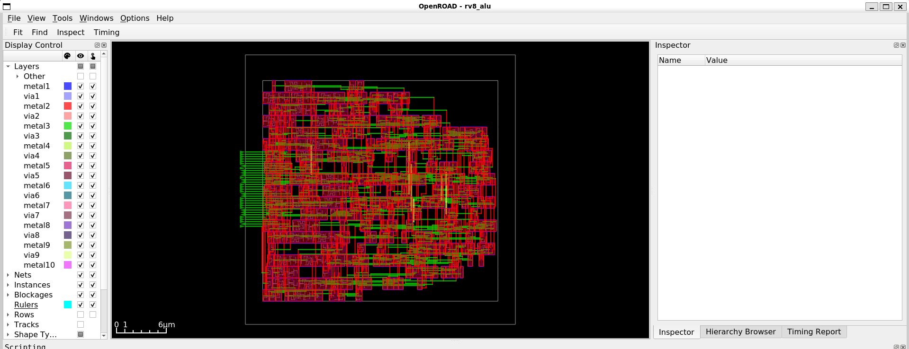

---

# 21. KLayout GDS Inspection

The generated GDSII was inspected in KLayout to verify that:

- The top-level `rv8_alu` cell exists
- Standard-cell geometry is present
- Routing geometry is visible
- Vias are present
- The final layout can be loaded successfully

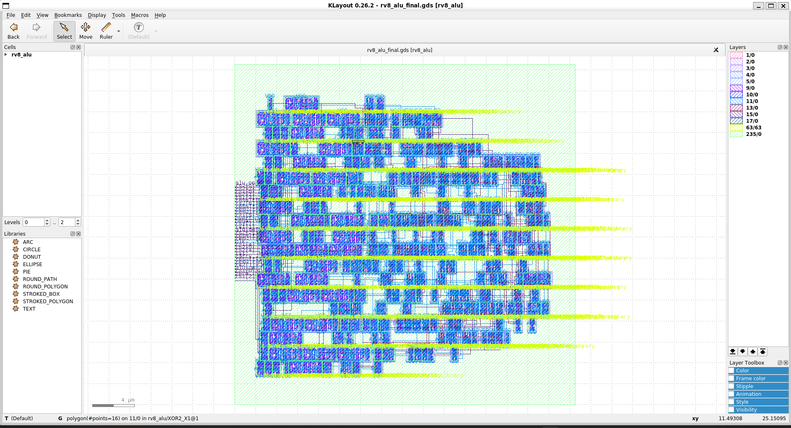

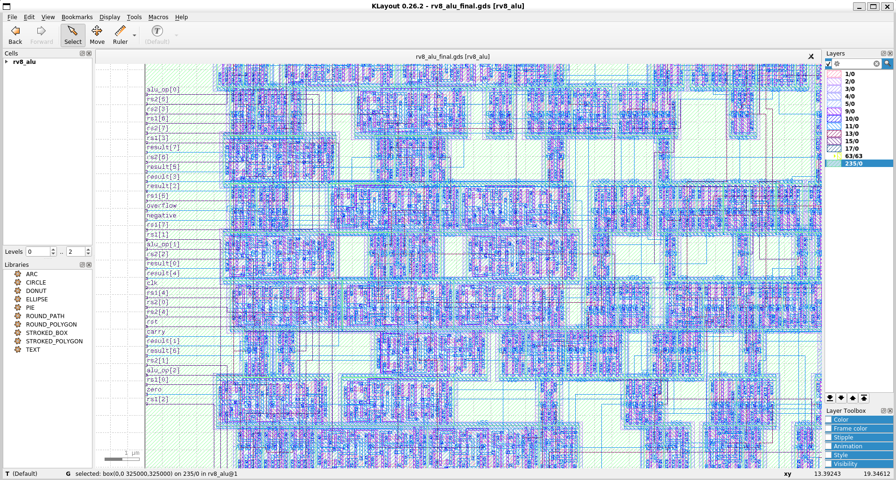

The FreePDK45 technology configuration maps layer `235/0` to the `OUTLINE` layer. Therefore, the green outline visible in KLayout is not metal routing.

---

# 22. KLayout 2.5D Visualization

KLayout 0.30.12 was used to create a 2.5D visualization of the routed layout.

The visualization was configured for:

```text
M1
VIA1
M2
VIA2
M3
VIA3
M4
```

This provides a clearer representation of the physical metal stack and via connections.

### 2.5D Views

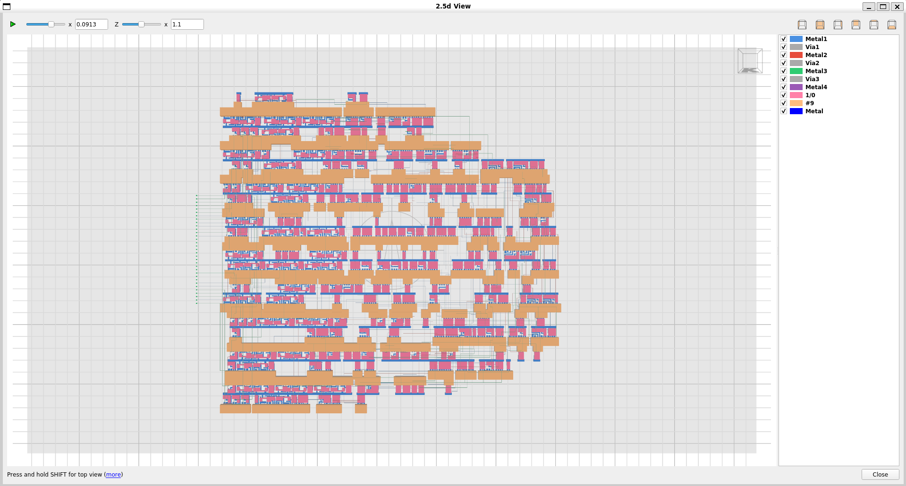

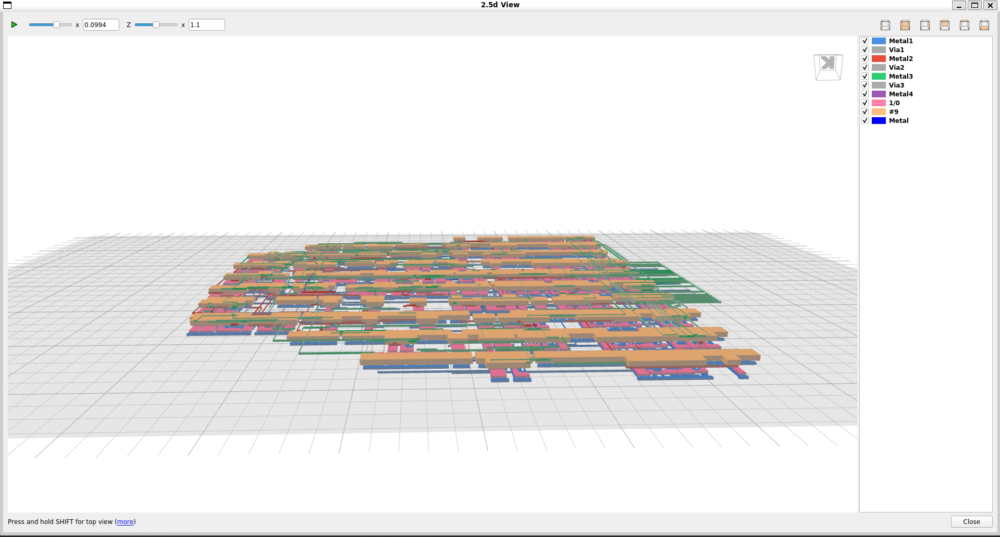

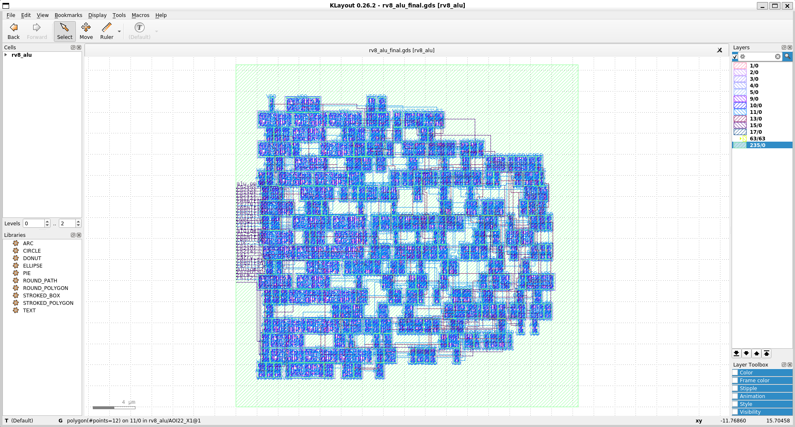

---

# 23. DRC Status

Initial DRC analysis was performed using the FreePDK45 KLayout DRC deck:

```text
FreePDK45.lydrc
```

The KLayout Marker Browser reported:

```text
Total markers: 78
Rule: WELL.4
```

The `WELL.4` rule corresponds to the minimum width requirement for nwell/polywell.

The current result is **not being claimed as DRC-clean**. All 78 reported markers are associated with `WELL.4`, and further investigation is required to determine whether these originate from the top-level design or standard-cell/library geometry.

> **DRC status: NOT SIGNED OFF**

---

# 24. LVS Status

LVS infrastructure is available through the Nangate45 standard-cell CDL data and Netgen/KLayout flow.

However, LVS has **not yet been completed and signed off** for this project.

> **LVS status: PENDING**

---

# 25. Power Analysis Status

A VCD-based activity annotation attempt was performed using the RTL simulation VCD.

The first attempt resulted in:

```text
Annotated 0 pin activities
```

Although OpenSTA produced a numerical power report, that number is **not treated as a valid activity-based final power result** because no pin activities were successfully annotated.

Therefore:

> **Final power: TBD**

A corrected gate-level activity annotation or an explicitly documented assumed-activity power analysis should be performed before reporting final power/PPA.

---

# 26. Current PPA Summary

| Metric | Current Result | Status |
|---|---:|---|
| Technology | Nangate45 | Complete |
| Clock | 10 ns / 100 MHz | Complete |
| Area | ~415 µm² | Complete |
| Reported utilization | ~55% | Complete |
| Core area | ~753 µm² | Complete |
| Total routed wirelength | ~2483 µm | Complete |
| Routing violations | 0 | Clean |
| Antenna violations | 0 | Clean |
| Worst setup slack | +8.86 ns | Clean |
| Worst hold slack | +0.13 ns | Clean |
| TNS | 0 ns | Clean |
| DRC | 78 WELL.4 markers | Pending investigation |
| LVS | Not completed | Pending |
| Power | TBD | Pending |

---

# 27. End-to-End Flow

The complete flow followed this sequence:

```text
SystemVerilog RTL
       |
       v
RTL Simulation
(Icarus Verilog)
       |
       v
Waveform Verification
(GTKWave)
       |
       v
Logic Synthesis
(Yosys)
       |
       v
Pre-Layout STA
(OpenSTA)
       |
       v
Floorplan
(OpenROAD)
       |
       v
Global Placement
       |
       v
Detailed Placement
       |
       v
Clock Tree Synthesis
       |
       v
Global Routing
       |
       v
Detailed Routing
       |
       v
Parasitic Extraction
       |
       v
SPEF
       |
       v
Post-Route STA
(OpenSTA)
       |
       v
GDSII Stream-Out
(KLayout)
       |
       v
GDS Inspection / DRC
(KLayout)
       |
       v
LVS
(Pending)
```

---

# 28. Key Learnings

This project provided practical experience with a complete ASIC implementation flow, including:

- Writing synthesizable RTL
- Designing a synchronous datapath
- Functional verification using a testbench
- Reading simulation waveforms
- Logic synthesis with a real standard-cell library
- Understanding mapped standard cells
- Creating SDC timing constraints
- Pre-layout STA
- Floorplan initialization
- Standard-cell placement
- I/O pin placement
- Clock-tree synthesis
- Global and detailed routing
- Parasitic extraction
- SPEF generation
- Post-route STA
- Physical design checks
- GDSII stream-out
- KLayout GDS inspection
- Initial DRC analysis
- Preparing an ASIC project for version control and technical presentation

---

# 29. Key Final Artifacts

| Artifact | Location |
|---|---|
| RTL | `rtl/rv8_alu.v` |
| Testbench | `tb/rv8_alu_tb.v` |
| SDC | `constraints/rv8_alu.sdc` |
| Synthesized netlist | `synthesis/rv8_alu_synth.v` |
| Post-route netlist | `results/rv8_alu_postroute.v` |
| Post-route DEF | `results/rv8_alu_postroute.def` |
| Final GDSII | `results/rv8_alu_final.gds` |
| SPEF | `results/rv8_alu.spef` |

---

# 30. Project Highlights

### RTL

- 8-bit synchronous ALU
- 8 arithmetic/logic operations
- Four status flags
- Verified with simulation

### Synthesis

- 271 mapped standard cells
- 31 flip-flops
- Nangate45 standard-cell library

### Physical Design

- ~415 µm² reported design area
- ~55% reported utilization
- 32.5 × 32.5 µm die
- CTS completed
- Detailed routing completed
- 0 routing violations
- 0 antenna violations

### Timing

- 100 MHz target clock
- +8.86 ns worst setup slack
- +0.13 ns worst hold slack
- 0 ns TNS

### Physical Output

- SPEF generated
- DEF generated
- GDSII generated
- GDS successfully inspected in KLayout

---

# 31. Future Work

The next steps are:

1. Investigate the 78 `WELL.4` DRC markers.
2. Complete LVS using the Nangate45 CDL/netlist.
3. Correctly perform activity-based power analysis.
4. If required, experiment with alternative I/O pin constraints and compare physical results.
5. Document final DRC/LVS/PPA results after sign-off.

---

# 32. Author

**Manchikanti Surya Vardhan**

M.Tech / VLSI Design

This project was developed as a hands-on study of open-source RTL-to-GDSII ASIC physical design.

---

## Repository

**GitHub:** `https://github.com/msuryavardhan/8BIT_ALU_PD`

If you find this project useful for learning ASIC physical design, feel free to explore the implementation and flow artifacts.
